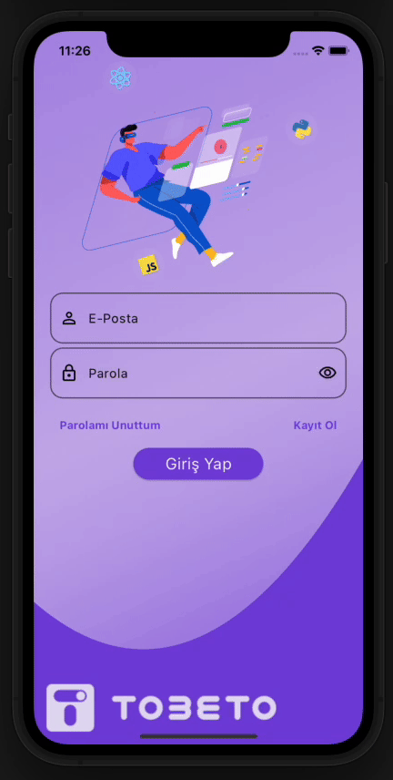

#  Tobeto Mobile App 

[Tobeto](https://tobeto.com) , eğitim ve öğrenme deneyimini dijital dünyada dönüştüren bir eğitim platformudur. Bu proje, Tobeto'nun kullanıcılarına sunulan zengin içeriği, öğrenme araçlarını ve kişiselleştirilmiş öğrenme deneyimini mobil cihazlara taşıyan bir uygulamadır.

## Özellikler

- ### Bloc Mimarisi ile Durum Yönetimi:
Bloc mimarisi, uygulamanın durum yönetimini sağlar, veri akışlarını kolayca kontrol eder ve uygulama mantığını ayrı modüller halinde organize eder.
- ### Firebase ile Kullanıcı Oluşturma: 
Firebase kimlik doğrulama servisi kullanılarak kullanıcıların hesap oluşturması ve oturum açması sağlanır.
- ### Firebase Storage Kullanımı: 
Kullanıcıların profil resimlerini depolamak ve yönetmek, uygulama içindeki diğer görsel verileri saklamak için Firebase Storage kullanılır. Bu sayede, kullanıcıların profil fotoğraflarını güvenli bir şekilde saklamamızı ve sunmamızı sağlar. Eğitim videoları gibi büyük dosyaları saklamak ve sunmak için de Firebase Storage kullanılır. Bu, uygulamanın daha hızlı ve verimli çalışmasını sağlar, çünkü kullanıcıların cihazlarına büyük dosyalar indirmesi gerekmez.
- ### Açık/Koyu Mod Geçişi: 
Kullanıcıların tercihlerine göre açık veya koyu modu seçmelerine olanak tanır, görsel deneyimi kişiselleştirir.
- ### Animasyon Kullanımı:
Ekran geçişleri, buton tıklamaları ve diğer etkileşimlerde animasyonlar kullanılarak uygulama kullanıcı dostu ve etkileyici bir deneyim sunar.
- ### iOS ve Android için Ayrı Tema Düzenlemesi: 
Hem iOS hem de Android platformları için ayrı temalar oluşturulur, her platformun tasarım diline uygun ve tutarlı bir görünüm sağlanır.

  ## Renk Referansı

| Renk             | Hex                                                                |
| ----------------- | ------------------------------------------------------------------ |
|koyu tema |  #1C1C40 |
|açık tema|  #E3DCF2 |
| vurgu rengi |  #00D29B |
| buton rengi |  #7743DB | 
## Çıkarılan Dersler

- ### Kullanıcı Deneyimi İyileştirmeleri:

Uygulama geliştirme sürecinde, kullanıcıların kolayca gezinebilmesi ve içeriklere erişebilmesi için arayüzde çeşitli iyileştirmeler yapıldı. Örneğin, menülerin yeniden düzenlenmesi, arama işlevinin geliştirilmesi gibi adımlar atıldı. Bu süreç, kullanıcı deneyimini geliştirmek için ne tür adımların etkili olduğunu gösterdi.
- ### Performans Optimizasyonları:
Uygulamanın daha hızlı ve verimli çalışması için çeşitli performans optimizasyonları yapıldı. Örneğin, gereksiz ağ isteklerinin azaltılması, bellek yönetiminin optimize edilmesi gibi adımların ardından uygulamanın yanıt sürelerinde belirgin bir iyileşme sağlandı. Bu süreç, mobil uygulama geliştirme sürecinde performansın nasıl artırılabileceğine dair önemli bilgiler verdi.
- ### Kod Kalitesi ve Bakımı:
Uygulama kod tabanının temiz tutulması ve bakımının düzenli yapılması için çeşitli stratejiler ve pratikler uygulandı. Örneğin, düzenli kod incelemeleri, kod standartlarının uygulanması gibi adımların ardından uygulamanın geliştirme ve bakım süreçlerinde daha verimli olundu. Bu süreç, kod kalitesinin neden önemli olduğunu ve nasıl sağlanabileceğini gösterdi.

  
## Yazarlar ve Teşekkür

Projenin her aşamasında beraber öğrendiğimiz ve ilerlediğimiz ekibimiz;

- [@cemguven4108](https://www.github.com/cemguven4108) 
- [@zehraCoskun](https://www.github.com/zehraCoskun) 
- [@BurakCanOzguc](https://www.github.com/BurakCanOzguc) 

Bizi bir araya getirdiği, motive ettiği ve öğrettikleri için tüm Tobeto ekibine teşekkürler.  

## Katkı

Katkılara her zaman açığız!

Proje, topluluk katkılarına açıktır. Hata düzeltmeleri, öneriler ve yeni özellikler için pull request'lerinizi bekliyoruz. 

Lütfen bu projenin `davranış kurallarına` uyun.

  
## Ekran Görüntüleri

  

